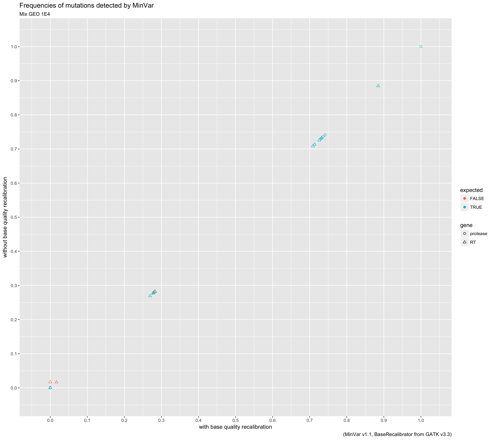
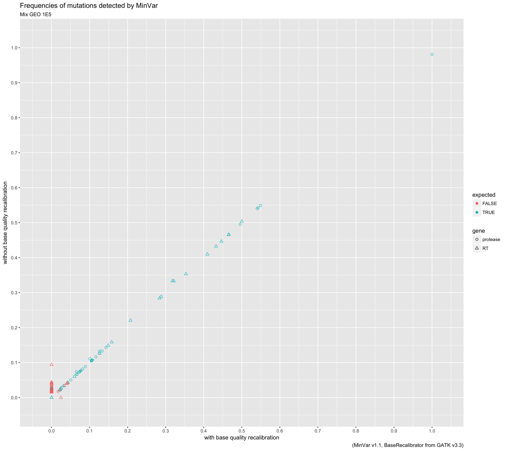
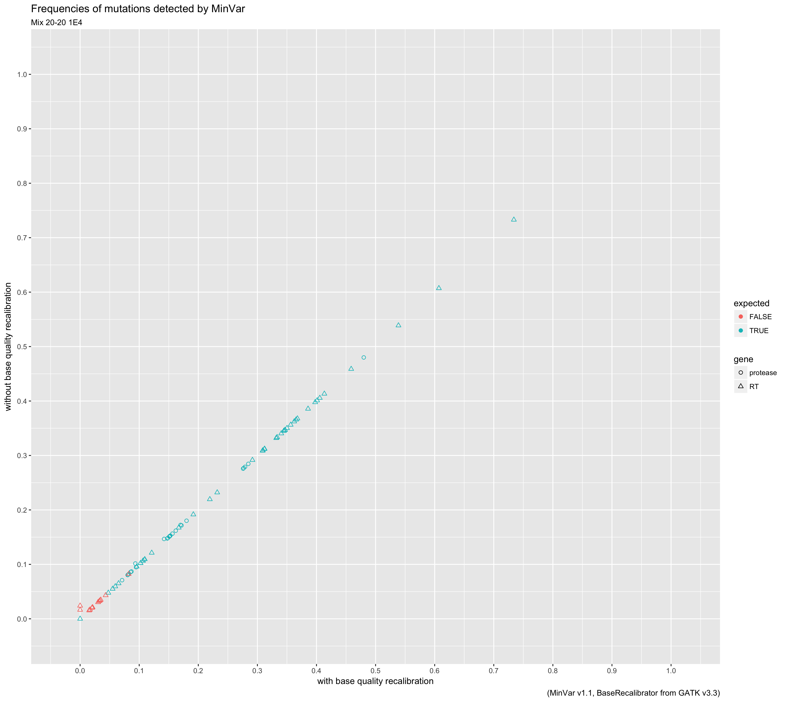
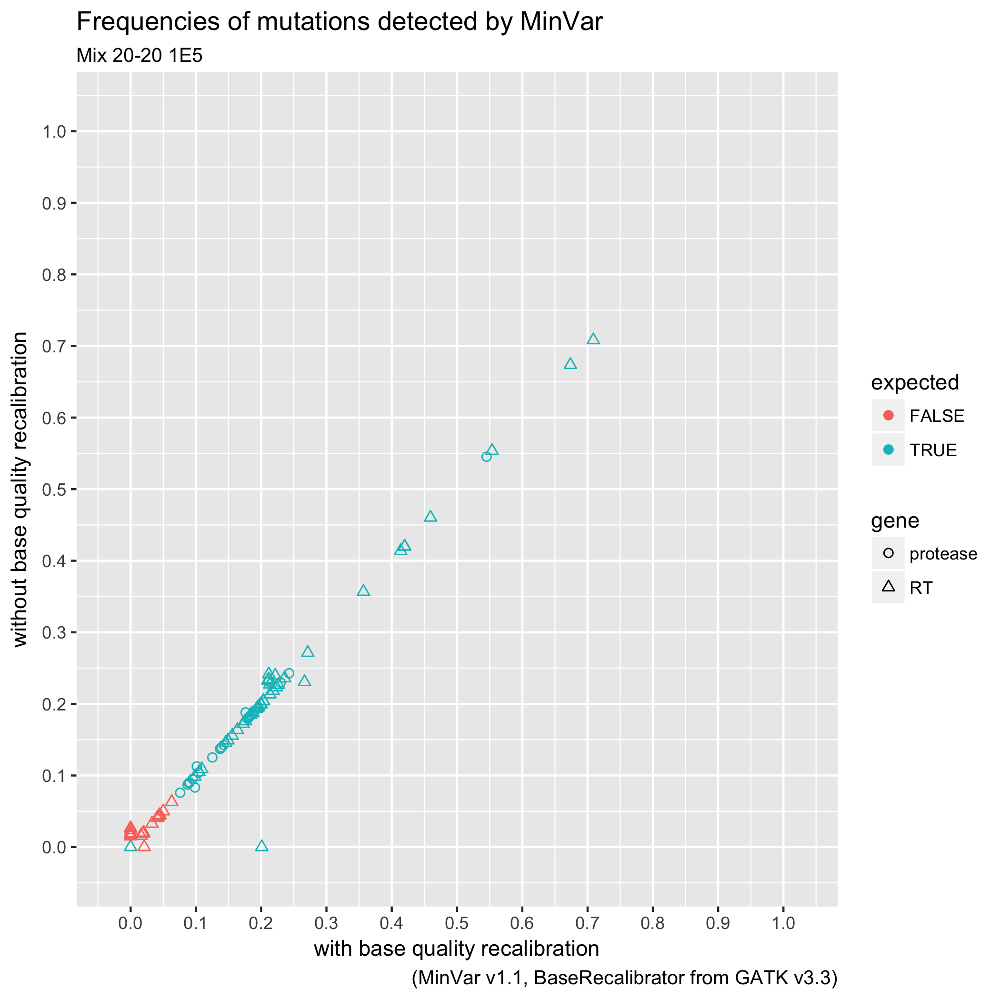
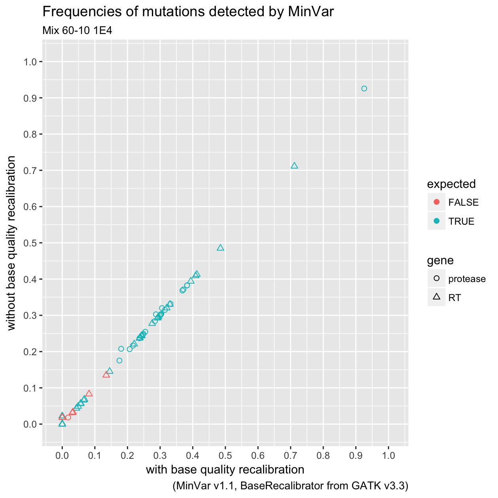
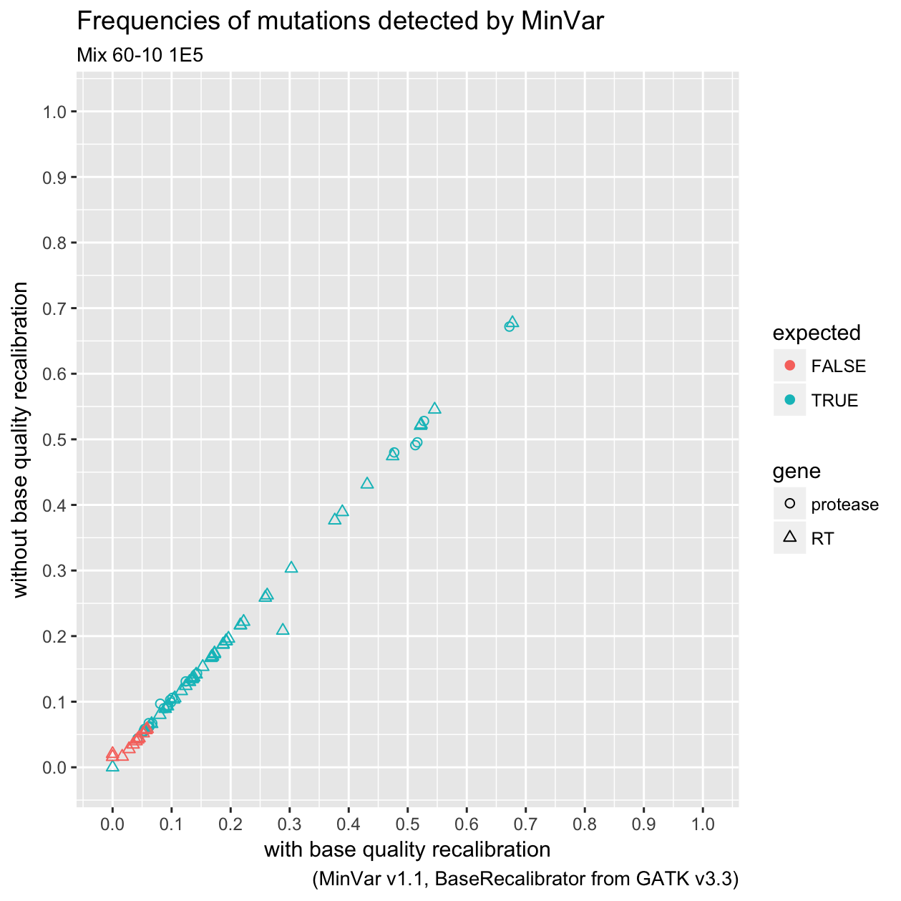
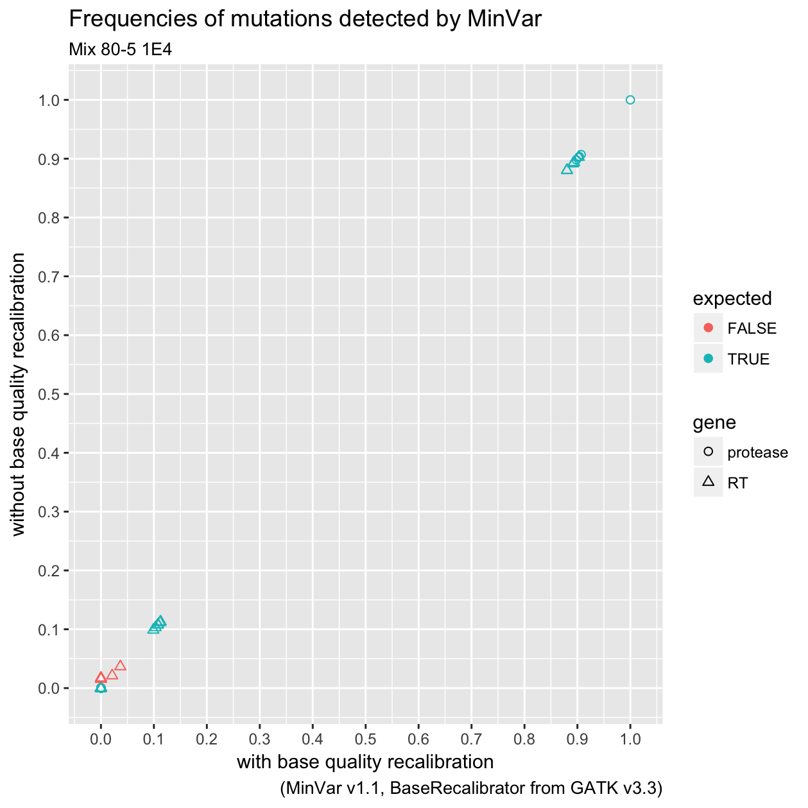
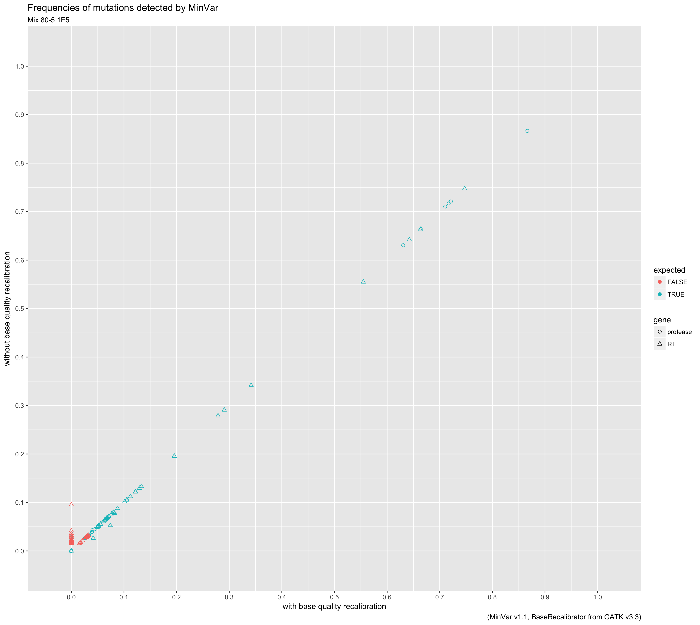
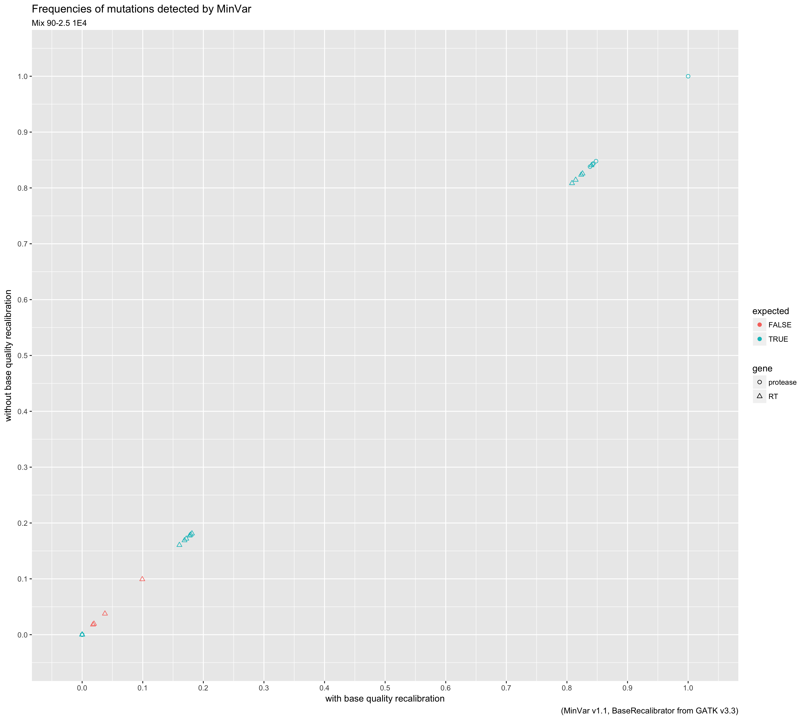
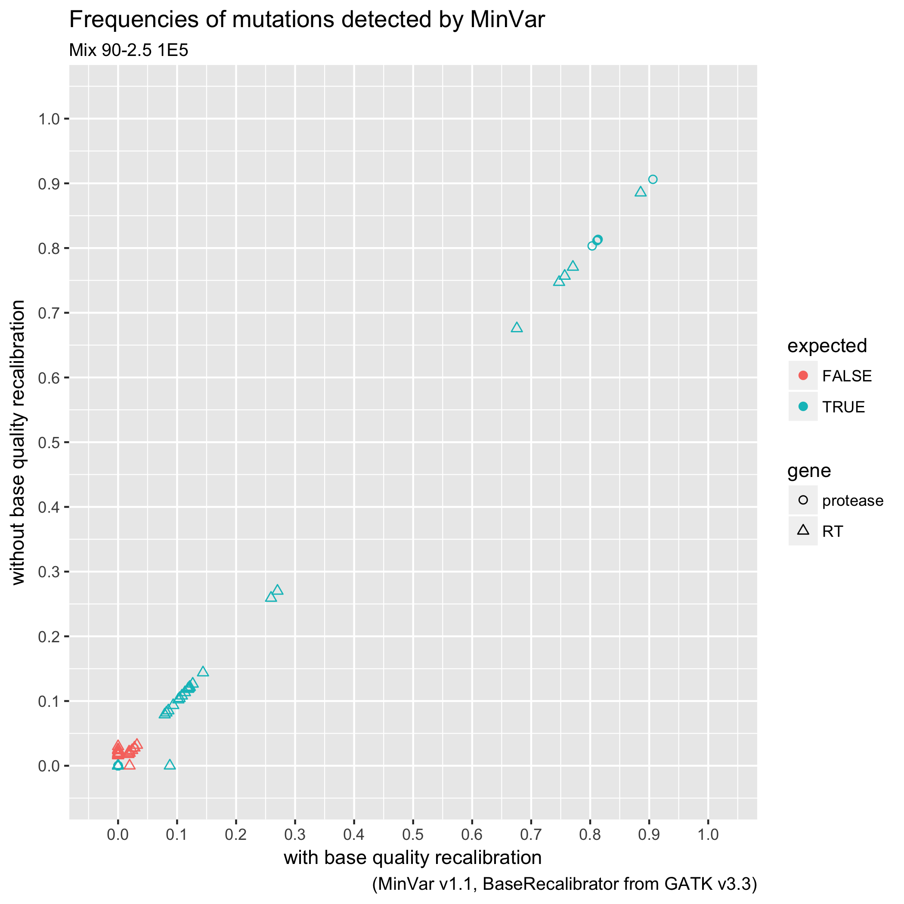

# Effect of recalibration

MinVar can call GATK BaseRecalibrator to adjust quality scores. Up to version
1.1 this option was on by default, from version 1.2 this has changed.
While GATK is free for non-commercial purposes, a licence must be acquired from
Broad Institute (creator of GATK) if one uses it for profit.

In order to support users in deciding whether to buy GATK licence or not,
this page displays a comparison of mutations detected with and without base
quality scores recalibration.

The following scatterplots report the frequencies of amino acid mutations in the
mixes used in the [MinVar paper](http://dx.doi.org/10.1016/j.jviromet.2016.11.008)
both with and without recalibration performed with GATK BaseRecalibrator. The
colours indicate whether the mutation was expected or not (_i.e._, present in
the original virus stocks), while the shape indicates the gene where it is
found (protease or reverse transcriptase).

The names of the mixes indicate different mixing proportions of viral stocks
and viral titers (100,000 and 10,000 copies/mL). See the paper and the file
`viral_mixes.md` in the [data repository](https://zenodo.org/record/44921) on Zenodo.

## Geometric mix (51.6%, 25.8%, 12.9%, 6.5%, and 3.2%)

## 20-20 mix (all five virus at 20%)

## 60-10 mix (one virus at 60%, others at 10%)

## 80-5 mix (one virus at 80%, others at 5%)

## 90-2.5 mix (one virus at 90%, others at 2.5%)

